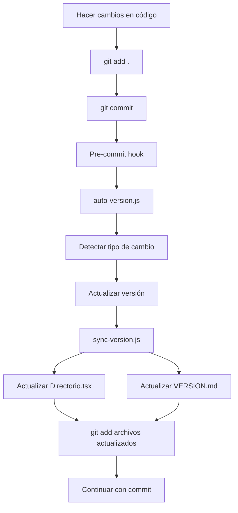

# 🤖 Sistema de Versionado Automático

## 📋 Descripción
Sistema automático de sincronización y actualización de versiones que mantiene consistencia entre `package.json`, `Directorio.tsx` y `VERSION.md`.

## 🔧 Componentes del Sistema

### 1. **Scripts de Sincronización**
- `scripts/sync-version.js` - Sincroniza versión y fecha entre archivos
- `scripts/auto-version.js` - Detecta automáticamente el tipo de cambio y actualiza versión
- `scripts/setup-hooks.js` - Configura Git hooks para automatización

### 2. **Git Hooks**
- `.githooks/pre-commit` - Se ejecuta antes de cada commit
- Actualiza automáticamente la versión basada en los archivos modificados

### 3. **Scripts NPM**
```json
{
  "sync-version": "Sincronización manual de versión",
  "auto-version": "Detección automática de tipo de versión",
  "version-patch": "Incremento de versión patch (x.x.X)",
  "version-minor": "Incremento de versión minor (x.X.x)",
  "version-major": "Incremento de versión major (X.x.x)",
  "setup-hooks": "Configurar Git hooks automáticos"
}
```

## 🚀 Instalación y Configuración

### Configuración Inicial
```bash
# 1. Configurar Git hooks automáticos
npm run setup-hooks

# 2. Verificar configuración
git config core.hooksPath
# Debe mostrar: .githooks
```

## 📖 Uso del Sistema

### 1. **Uso Automático (Recomendado)**
```bash
# El sistema funciona automáticamente en cada commit
git add .
git commit -m "tu mensaje"
# ↑ Se ejecuta automáticamente la sincronización
```

### 2. **Uso Manual**
```bash
# Detectar automáticamente el tipo de versión
npm run auto-version

# Incrementar versión específica
npm run version-patch    # 1.7.0 → 1.7.1
npm run version-minor    # 1.7.0 → 1.8.0
npm run version-major    # 1.7.0 → 2.0.0

# Solo sincronizar (sin cambiar versión)
npm run sync-version
```

## 🎯 Detección Automática de Versión

### **Cambios MAJOR (X.x.x)**
- Modificaciones en `package.json`
- Cambios en `src/App.tsx`
- Cambios en `src/main.tsx`
- Modificaciones en configuración (`vite.config.ts`, `tsconfig.json`)

### **Cambios MINOR (x.X.x)**
- Nuevos componentes en `src/pages/` o `src/components/`
- Cambios en servicios (`src/services/`)
- Nuevos scripts en `scripts/`
- Funcionalidades nuevas

### **Cambios PATCH (x.x.X)**
- Correcciones de bugs
- Actualizaciones de documentación
- Cambios menores en estilos
- Ajustes de configuración

## 📁 Archivos Sincronizados

### 1. **package.json**
```json
{
  "version": "1.7.0"  ← Fuente principal
}
```

### 2. **src/pages/Directorio.tsx**
```tsx
// Versión mostrada en UI
v1.7.0 ({getBuildInfo()})

// Fecha de compilación
const buildDate = new Date('2025-09-16T23:15:30.000Z');
```

### 3. **VERSION.md**
```markdown
## 🚀 Versión 1.7.0 - [2025-09-16 23:15:30]
...
*Última actualización: 2025-09-16 23:15:30*
```

## 🔄 Flujo de Trabajo



## ⚡ Beneficios

✅ **Automatización completa** - Sin intervención manual  
✅ **Consistencia garantizada** - Versión sincronizada en todos los archivos  
✅ **Historial ordenado** - VERSION.md actualizado automáticamente  
✅ **Fechas precisas** - Timestamp exacto de cada actualización  
✅ **Detección inteligente** - Tipo de versión basado en cambios reales  

## 🛠️ Solución de Problemas

### Error: "hooks no funcionan"
```bash
# Verificar configuración
git config core.hooksPath
# Si no muestra .githooks:
npm run setup-hooks
```

### Error: "no se encuentra sync-version.js"
```bash
# Verificar que existe el archivo
ls scripts/sync-version.js
# Si no existe, reinstalar scripts
```

### Versión no actualizada
```bash
# Sincronización manual
npm run sync-version

# Forzar detección automática
npm run auto-version
```

## 📝 Notas Importantes

- El sistema funciona automáticamente en cada commit
- Los cambios de versión se agregan automáticamente al commit actual
- La fecha y hora se actualizan en tiempo real
- Compatible con Windows, macOS y Linux
- No requiere configuración adicional después de `npm run setup-hooks`

---

*Última actualización: 2025-09-16 23:15:30*
